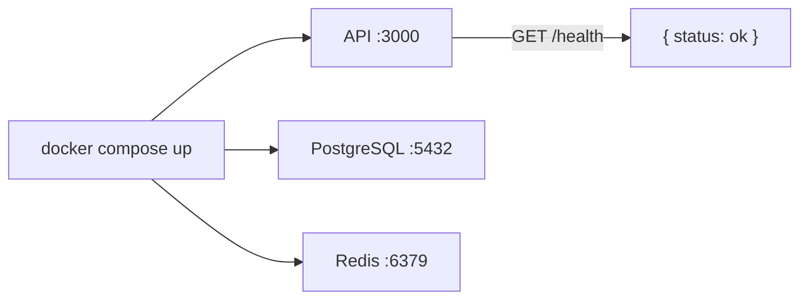
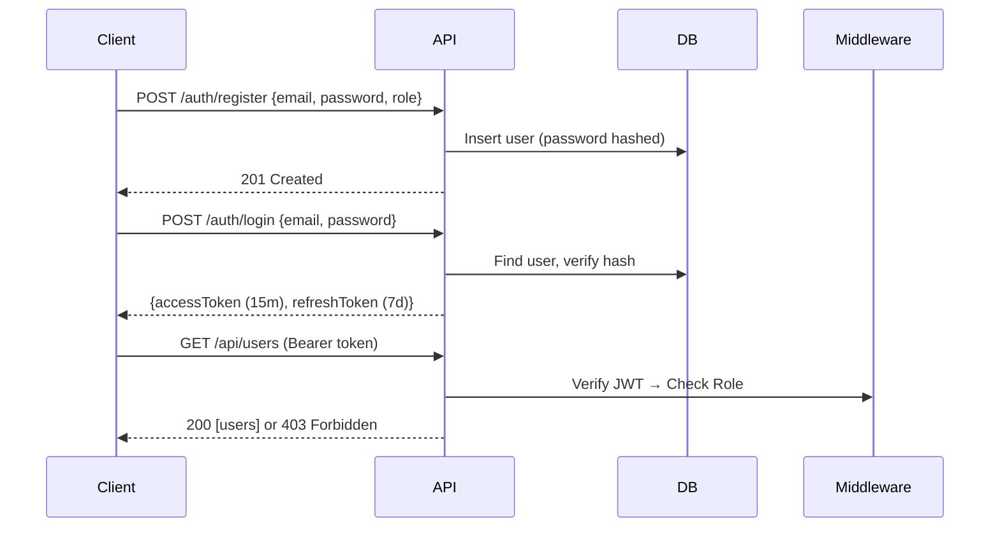
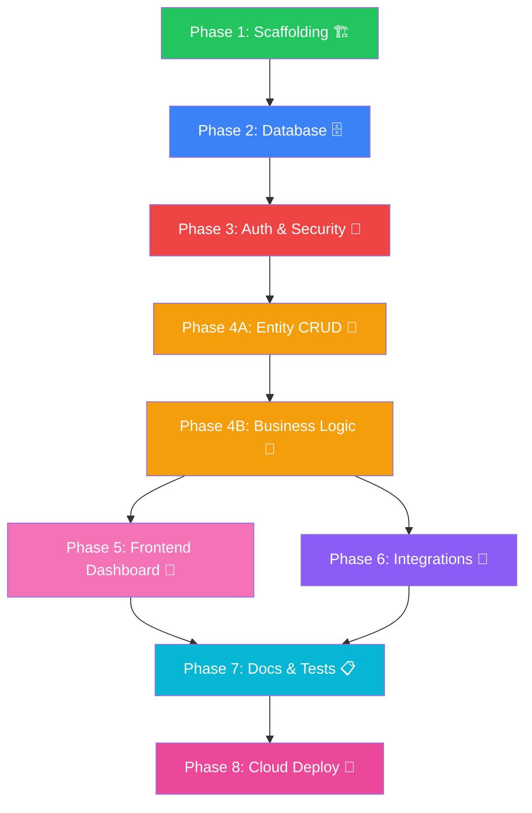

# CampusOps — Phased Implementation Roadmap

Distributed, cloud-native backend for the CampusOps campus management platform designed for **Distributed Applications** and **Cloud Computing** courses.

**Stack**: Node.js + TypeScript + Express · PostgreSQL + Prisma · Redis · Docker Compose

---

## Phase 1 — Scaffolding & Infrastructure 🏗️
> **Goal**: Get a running containerized API with a connected database. Zero business logic, just the skeleton.
>
> **Deliverable**: `docker compose up` → Express server responds on `localhost:3000/health` ✅

| # | Task | Files |
|---|------|-------|
| 1 | Init Node.js + TypeScript project | `package.json`, `tsconfig.json` |
| 2 | Create Express app with health check | `src/index.ts`, `src/app.ts` |
| 3 | Environment config with Zod validation | `src/config/env.ts`, `.env.example` |
| 4 | Docker Compose (API + PostgreSQL + Redis) | `docker-compose.yml`, `Dockerfile` |
| 5 | Prisma setup + empty schema | `prisma/schema.prisma` |
| 6 | Logging (Winston) + error handler | `src/middleware/logger.ts`, `errorHandler.ts` |

---

## Phase 2 — Database & Models 🗄️
> **Goal**: Full database schema from ERD, migrations, and seed data with demo accounts.
>
> **Deliverable**: Run `npm run db:seed` → 5 demo users, sample data in all tables ✅

| # | Task | Models Created |
|---|------|---------------|
| 1 | Define all Prisma models + enums | `Branch`, `User`, `Module`, `Group` |
| 2 | Define relational models | `GroupStudent`, `Planning`, `Absence` |
| 3 | Define tracking models | `Progress`, `Payment`, `Notification` |
| 4 | Generate + run migration | `prisma/migrations/` |
| 5 | Seed data script with demo accounts | `prisma/seed.ts` |

Demo accounts (password: `CampusOps@2026`):
| Email | Role |
|-------|------|
| `hamza.khchichine@eidia.ueuromed.org` | Admin |
| `karima.eddahhak@eidia.ueuromed.org` | Scolarite |
| `imad.adnane@eidia.ueuromed.org` | Enseignant |
| `siham.lyzoul@eidia.ueuromed.org` | Etudiant |
| `brahim.nakkar@eidia.ueuromed.org` | Etudiant |

---

## Phase 3 — Authentication & Security 🔐
> **Goal**: Secure JWT auth flow with RBAC. No one accesses anything without proper tokens + role.
>
> **Deliverable**: Register → Login → Get JWT → Access protected endpoints ✅

| # | Task | Files |
|---|------|-------|
| 1 | JWT utilities (sign, verify, refresh) | `src/utils/jwt.ts` |
| 2 | Password hashing (bcrypt) | `src/utils/hash.ts` |
| 3 | Auth service (register, login, refresh) | `src/modules/auth/auth.service.ts` |
| 4 | Auth controller + routes | `auth.controller.ts`, `auth.routes.ts` |
| 5 | JWT middleware (verify token on requests) | `src/middleware/auth.ts` |
| 6 | RBAC middleware (`requireRole(...)`) | `src/middleware/rbac.ts` |
| 7 | Request validation (Zod schemas) | `src/middleware/validator.ts` |
| 8 | Security hardening (helmet, cors, rate-limit) | Applied in `app.ts` |

---

## Phase 4 — Core CRUD APIs 📡
> **Goal**: Full REST API for all business modules. Each module = controller + service + routes + validation.
>
> **Deliverable**: All endpoints working in Swagger UI at `/api/docs` ✅

Split into **two sub-phases** to stay manageable:

### Phase 4A — Entity Management
| Module | Endpoints | Min. Role to Write |
|--------|-----------|-------------------|
| **Branches** | `GET, POST, PUT, DELETE /api/branches` | Admin |
| **Users** | `GET, POST, PUT, DELETE /api/users` | Admin |
| **Modules** | `GET, POST, PUT, DELETE /api/modules` | Scolarite |
| **Groups** | `GET, POST, PUT, DELETE /api/groups` | Scolarite |
| **Groups** | `POST /api/groups/:id/students` (enroll) | Scolarite |

### Phase 4B — Business Logic
| Module | Endpoints | Min. Role to Write |
|--------|-----------|-------------------|
| **Planning** | CRUD + `GET /today` + `GET /week` | Scolarite |
| **Absences** | Mark + justify + stats | Enseignant |
| **Progress** | Update % + history | Enseignant |
| **Payments** | CRUD + overdue alerts | Scolarite |
| **Notifications** | List + mark-read | All (own) |

---

## Phase 5 — Frontend Dashboard 🎨
> **Goal**: Professional React SPA connected to the backend API. Role-based views, real-time data, premium design.
>
> **Deliverable**: Fully working dashboard at `localhost:5173` — login, navigate, manage data ✅

**Stack**: React 19 + Vite + TypeScript + React Router + Axios

| # | Task | Pages/Components |
|---|------|------------------|
| 1 | Init Vite + React + TS project | `d:\Openclaw\frontend\` |
| 2 | Design system (colors, typography, layout) | Global CSS + theme |
| 3 | Auth pages (Login, Register) | JWT token storage |
| 4 | Dashboard layout (sidebar, topbar, content) | Role-aware navigation |
| 5 | Planning page (calendar/agenda view) | Daily + weekly views |
| 6 | Absences page (mark + stats) | Tables + charts |
| 7 | Payments page (status + alerts) | Filters + status badges |
| 8 | Progress page (% bars by module/group) | Visual progress bars |
| 9 | Notifications panel | Real-time badge count |
| 10 | Students/Users management (Admin) | CRUD tables |

---

## Phase 6 — Integrations & Bots 🤖
> **Goal**: Connect the backend to the outside world — Telegram, Email, OpenClaw.
>
> **Deliverable**: Telegram bot responds to `/today`, email reads inbox, OpenClaw triggers work ✅

| # | Task | Files |
|---|------|-------|
| 1 | Telegram bot setup + `/start`, `/help` | `src/integrations/telegram/bot.ts` |
| 2 | OTP-based account linking (`/link`) | `src/utils/otp.ts` |
| 3 | Bot commands: `/today`, `/week`, `/absence`, `/progress` | `src/integrations/telegram/commands/` |
| 4 | SMTP email sending | `src/integrations/email/smtp.ts` |
| 5 | IMAP inbox reading | `src/integrations/email/imap.ts` |
| 6 | Mail API endpoints (`GET /mail/latest`, `POST /mail/send`) | `src/modules/mail/` |
| 7 | OpenClaw webhook receivers | `src/integrations/openclaw/` |
| 8 | Cron: daily planning notifications at 7 AM | `src/integrations/openclaw/cron.ts` |

---

## Phase 7 — Docs, Tests & Polish 📋
> **Goal**: Production-ready quality — API docs, tests, and clean error handling.
>
> **Deliverable**: `npm test` passes, Swagger docs complete, README written ✅

| # | Task | Details |
|---|------|---------|
| 1 | Swagger/OpenAPI annotations on all routes | Auto-generated UI at `/api/docs` |
| 2 | Unit tests (Jest): JWT, hashing, RBAC | `src/modules/auth/auth.test.ts` etc. |
| 3 | Integration tests: auth flow + CRUD | `tests/integration/` |
| 4 | README with setup instructions | `README.md` |
| 5 | Seed data refinement | Realistic demo scenarios |

---

## Phase 8 — Cloud Deployment & Demo 🚀
> **Goal**: Deploy to cloud, demonstrate distributed architecture concepts.
>
> **Deliverable**: Live URL + demo video ✅

| # | Task | Details |
|---|------|---------|
| 1 | Deploy PostgreSQL to managed service (Supabase/Neon) | Free tier |
| 2 | Deploy API to Railway/Render/Azure | Container-based |
| 3 | Deploy Frontend to Vercel/Netlify | Auto-deploy from Git |
| 4 | Configure environment for cloud | `.env.production` |
| 5 | Health checks + monitoring | `/health` endpoint |
| 6 | Demo recording (5–10 min) | Full walkthrough |

---

## Execution Order & Dependencies

> [!TIP]
> **We'll build and verify each phase before moving to the next.** After each phase you'll have a working, testable increment — no more "everything at once" complexity.
