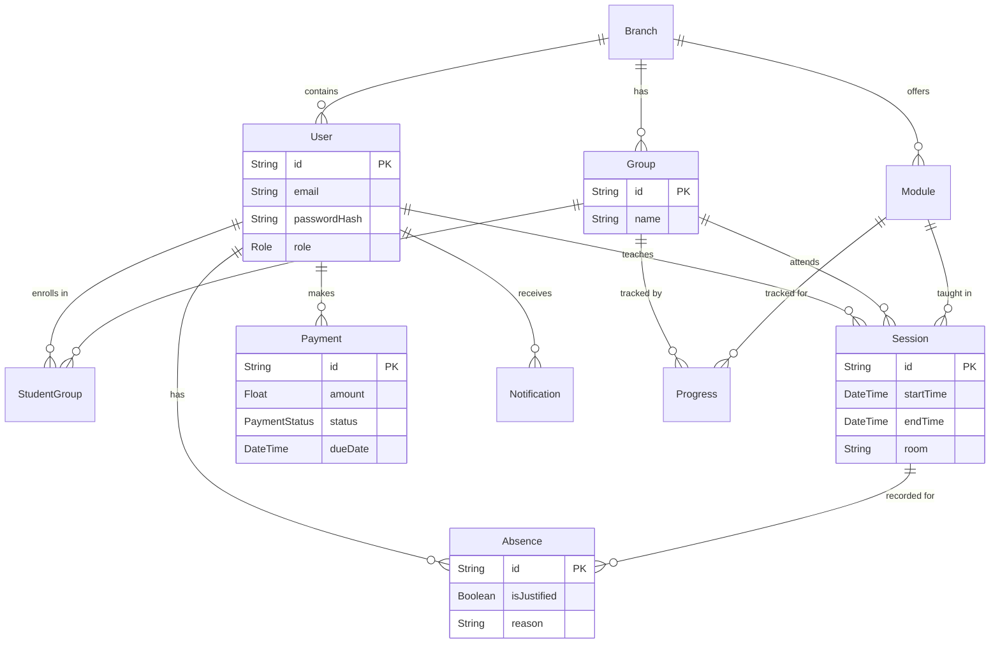

# Cahier des Charges - CampusOps

**Projet :** Plateforme de gestion universitaire unifiée (CampusOps)
**Cadre :** Projet de fin de semestre - Cloud et Applications Réparties
**Auteur :** Hamza Khchichine (EIDIA - UEMF)

---

## 1. Présentation du Projet

### 1.1 Contexte
L'université moderne nécessite une gestion intégrée de multiples flux d'informations : planification des cours, assiduité, suivi pédagogique, paiements, et communication. Actuellement, ces processus sont souvent fragmentés entre plusieurs systèmes (tableurs, emails, ERPs obsolètes). Le projet **CampusOps** vise à fournir une solution cloud-native, centralisée et unifiée pour l'établissement **EIDIA (Université Euro-Méditerranéenne de Fès)**.

### 1.2 Objectif
L'objectif est de développer une API REST sécurisée, accompagnée d'un tableau de bord dynamique et d'une intégration omnicanale (Email, Telegram). Le système doit être hautement disponible, sécurisé par rôles (RBAC) et capable de s'interfacer avec des outils d'automatisation externes (OpenClaw) via des webhooks.

---

## 2. Spécifications Fonctionnelles

Le système répond aux besoins de 4 acteurs principaux :
1. **Administrateur** (Vue globale, configuration, gestion des utilisateurs)
2. **Scolarité** (Gestion des emplois du temps, inscriptions, paiements)
3. **Enseignant** (Saisie des absences, notes, avancement)
4. **Étudiant** (Consultation du planning, absences, notes, paiements)

### 2.1 Modules Principaux

1. **Authentification & Sécurité :**
   - Inscription et connexion avec génération de tokens JWT (Access & Refresh).
   - Réinitialisation de mot de passe via OTP/Token envoyé par email (SMTP).
   - Contrôle d'accès basé sur les rôles (RBAC).

2. **Gestion Académique (Core) :**
   - Gestion hiérarchique : Établissement (Branch) ➔ Filière/Module ➔ Groupe (ex: CS-G1).
   - Attribution des modules aux enseignants et des étudiants aux groupes.

3. **Planification & Assiduité :**
   - Création et consultation dynamique des emplois du temps (Planning).
   - Saisie rapide des absences par l'enseignant pour une session donnée.
   - Statistiques globales d'assiduité pour le service Scolarité.

4. **Avancement Pédagogique :**
   - Suivi du pourcentage de complétion des modules.
   - Historique des chapitres/modules enseignés avec remarques de l'enseignant.

5. **Gestion Financière :**
   - Suivi des paiements des étudiants (Frais de scolarité, mensualités).
   - Envoi automatique de reçus de paiement par email.
   - Filtrage des paiements en retard.

6. **Communication & Notifications :**
   - Centre de notifications in-app pour tous les acteurs.
   - **Intégration Telegram :** Un bot permettant aux utilisateurs de lier leur compte via un OTP et d'interroger leur planning, absences et avancement pédagogique via des commandes (`/today`, `/week`, `/absence`).
   - **Intégration Email :** Envoi de notifications sortantes via SMTP (Gmail) et lecture de la boîte de réception via IMAP.

### 2.2 Cas d'Utilisation (UML)

```mermaid
usecaseDiagram
    actor "Étudiant" as etudiant
    actor "Enseignant" as enseignant
    actor "Scolarité" as scolarite
    actor "Administrateur" as admin

    etudiant --> (Consulter Planning)
    etudiant --> (Consulter Absences)
    etudiant --> (Lier compte Telegram)

    enseignant --> (Saisir Absences)
    enseignant --> (Mettre à jour Avancement)
    enseignant --> (Consulter Planning)

    scolarite --> (Créer Groupes & Modules)
    scolarite --> (Valider Paiements)
    scolarite --> (Gérer Planning)

    admin --> (Gérer Utilisateurs)
    admin --> (Configuration Globale)

    admin -|> scolarite
```

---

## 3. Spécifications Techniques

### 3.1 Architecture du Système
L'application repose sur une architecture Cloud-Native orientée micro-services :

- **Backend :** Node.js avec Express et TypeScript.
- **Base de données :** PostgreSQL (relationnel) gérée via Prisma ORM.
- **Cache & Sessions :** Redis (gestion des tokens de réinitialisation et rate-limiting).
- **Frontend :** Interface web dynamique en React 18 avec Babel standalone.
- **Intégrations :** Nodemailer (SMTP/IMAP) et Telegram Bot API.

### 3.2 Modèle de Données (ERD)

Le diagramme entité-relation ci-dessous illustre la structure normalisée de la base de données PostgreSQL gérée par Prisma :



### 3.3 Intégration OpenClaw (Webhooks & Automatisation)
Afin de respecter les contraintes du projet, des endpoints spécifiques (`/api/openclaw/webhook` et `/api/openclaw/trigger/*`) ont été mis en place pour s'intégrer avec la plateforme d'automatisation **OpenClaw**. 

**Workflows automatisés :**
1. **Rappel de Planning (Daily Trigger) :** Chaque jour à 07h00, OpenClaw interroge l'API qui envoie par Telegram le planning du jour aux enseignants et étudiants.
2. **Notification d'absence :** Lorsqu'une absence est saisie par un enseignant, un webhook notifie OpenClaw qui route l'information pour envoyer un avertissement Telegram à l'étudiant concerné.
3. **Paiements en retard :** Scan périodique des paiements avec envoi d'emails de relance.

---

## 4. Contraintes Non-Fonctionnelles

- **Sécurité :** Les requêtes API doivent être validées via `zod`. Les mots de passe sont hachés via `bcrypt` avec un coût (salt rounds) de 12. Les routes sensibles exigent un JWT Bearer valide (Access token valide 15min, Refresh token valide 7j).
- **Performance :** Limitation du taux de requêtes (Rate-Limiting) implémentée avec Redis pour contrer les attaques DDoS.
- **Portabilité :** Le backend est containerisé via un `Dockerfile` et structuré via `docker-compose.yml` pour le déploiement sur Render, Railway, ou toute instance cloud Docker.
- **Anti-Enumération :** La route de récupération de mot de passe répond de façon générique (toujours code 200) pour empêcher l'énumération des adresses emails.

---

## 5. Livrables & Déploiement

1. **Code Source :** Dépôt GitHub complet incluant le Backend, le Frontend et la documentation d'API.
2. **Documentation API :** Interface interactive générée via Swagger (`/api/docs`).
3. **Déploiement Cloud :** Serveurs hébergés en continu avec configurations CI/CD (`render.yaml`).
4. **Jeu de données de test :** Fichier `prisma/seed.ts` injectant des données réalistes (Comptes EIDIA, modules, plannings) pour évaluer la solution immédiatement.

***
*Document rédigé dans le cadre de l'évaluation du module Cloud Computing & Applications Réparties.*
