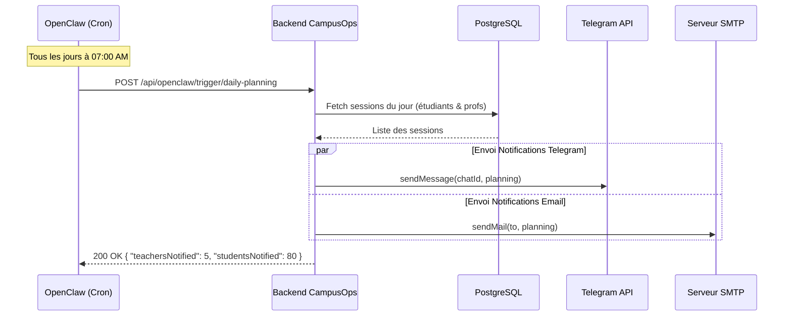
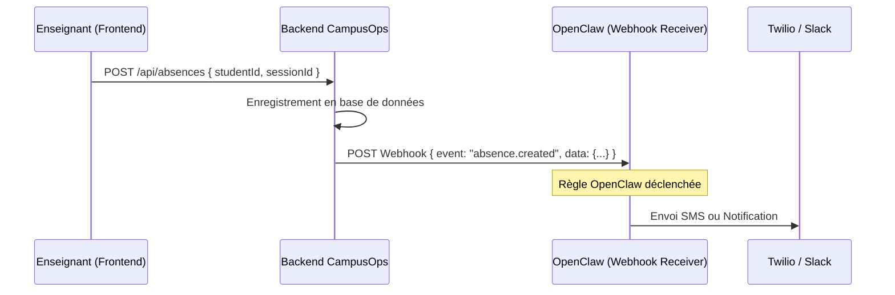

# Rapport d'Intégration OpenClaw - CampusOps

**Projet :** CampusOps (Système de Gestion Universitaire)
**Module :** Cloud & Applications Réparties
**Objectif :** Expliciter l'intégration des flux de travail automatisés via OpenClaw.

---

## 1. Vue d'Ensemble de l'Intégration

CampusOps agit à la fois comme **déclencheur (Trigger)** et **exécuteur (Action)** au sein de l'écosystème OpenClaw. Afin d'automatiser des processus fastidieux tels que les rappels d'emplois du temps et les notifications d'absences, le système expose des Webhooks RESTful sécurisés.

L'objectif de cette intégration est de dissocier la logique métier de l'application (Backend CampusOps) de la logique de planification et de routage (OpenClaw).

---

## 2. Workflows Automatisés (Flux de données)

### Workflow 1 : Rappel Quotidien du Planning (CRON ➔ Action)

Chaque matin, les enseignants et les étudiants doivent recevoir leur emploi du temps de la journée par email et sur Telegram. Au lieu de gérer un CRON interne complexe, CampusOps délègue le déclenchement temporel à OpenClaw.

**Schéma du flux :**

**Détail technique :**
- L'URL appelée par OpenClaw est une route hautement privilégiée de l'API CampusOps.
- Le backend CampusOps interroge la base de données (PostgreSQL), génère un récapitulatif formaté, et orchestre simultanément des requêtes vers le bot Telegram et le serveur SMTP.

### Workflow 2 : Notification d'Absence en Temps Réel (Event ➔ OpenClaw ➔ SMS/Email)

Lorsqu'un enseignant déclare un étudiant absent, CampusOps agit comme **Déclencheur**. Il envoie un événement (Webhook) vers OpenClaw qui peut ensuite être connecté à d'autres services tiers (par exemple, Twilio pour un SMS, ou Slack).

**Schéma du flux :**

---

## 3. Sécurité de l'Intégration (Webhooks HMAC)

Puisque les endpoints OpenClaw déclenchent des actions massives (envoi d'emails à 1000+ étudiants), la sécurité est primordiale. 

1. **Authentification par Token :**
   CampusOps exige que les requêtes venant d'OpenClaw contiennent un Header HTTP spécifique (ex: `Authorization: Bearer <ADMIN_TOKEN>`) ou une signature HMAC (`x-openclaw-signature`).

2. **Validation des Payloads (Zod) :**
   Toutes les données entrantes (les événements POSTés par OpenClaw) sont strictement validées par le validateur de schémas `Zod` avant d'être traitées par le contrôleur Node.js, bloquant ainsi toute injection NoSQL ou XSS.

---

## 4. Endpoints d'Intégration Existant dans l'API

L'API CampusOps expose un espace de noms dédié `/api/openclaw/*` :

| Méthode | Endpoint | Description |
|---------|----------|-------------|
| `POST` | `/api/openclaw/trigger/daily-planning` | Route actionnée par un Cron OpenClaw pour déclencher l'envoi du planning. |
| `POST` | `/api/openclaw/webhook` | Endpoint générique pour recevoir d'autres événements depuis OpenClaw (ex: validation d'un paiement externe). |

## 5. Conclusion

Grâce à OpenClaw, le backend de CampusOps reste léger, concentré sur la donnée et la logique métier. La délégation des déclencheurs temporels et des chaînes d'événements complexes (If-This-Then-That) rend l'architecture robuste et infiniment scalable en milieu universitaire.
